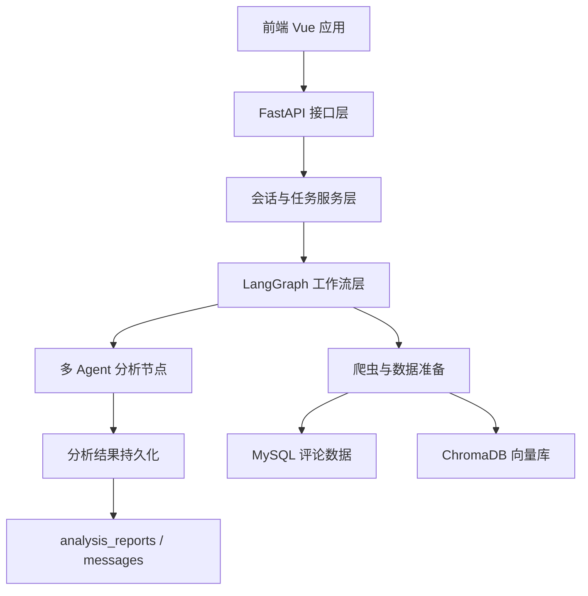
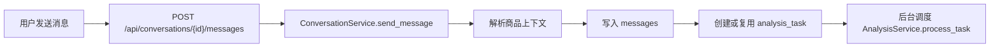
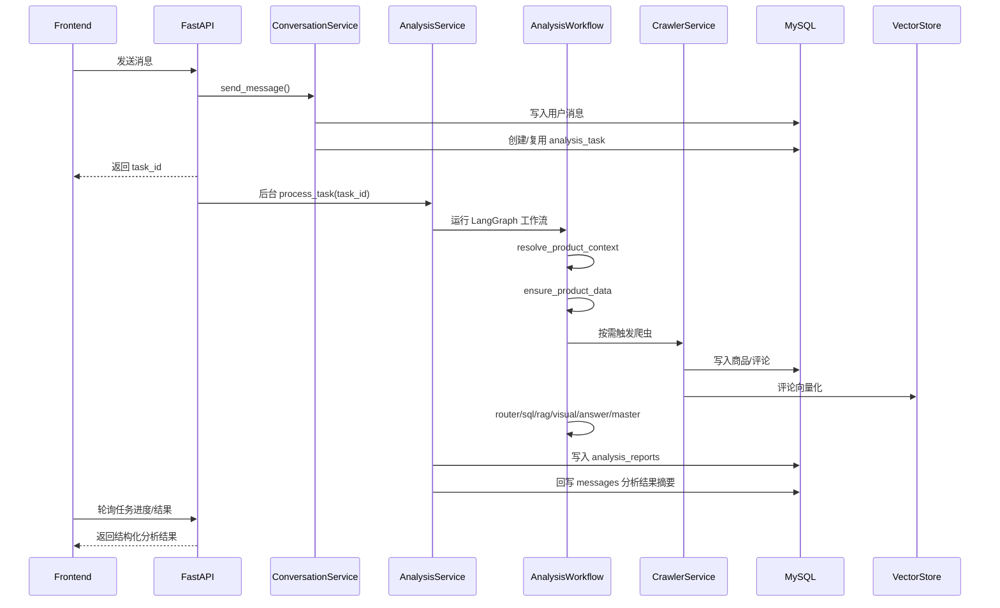
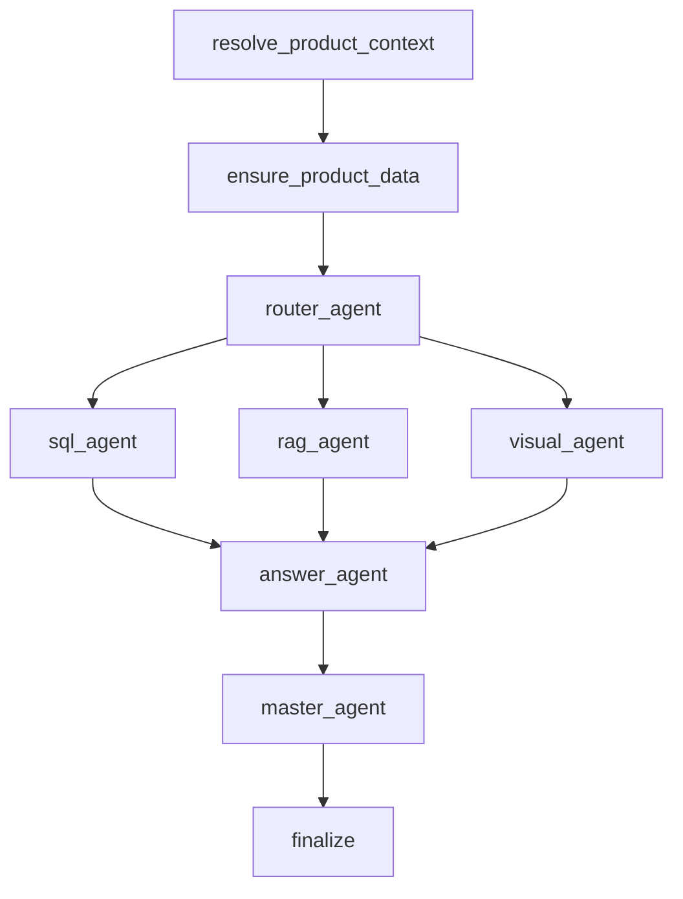

# 系统整体架构图

## 1. 文档定位

本文档严格按照当前项目最新实现更新，不再沿用旧版“普通聊天链路”和“商品分析链路”分离的描述。  
当前系统已经完成向《[0.【多Agent协作设计草案】](/D:/学业/大四/毕业设计/MA-ESAS-1/docs/0.【多Agent协作设计草案】.md)》目标架构的迁移，后端真实实现为：

- 统一消息入口
- 任务化分析调度
- LangGraph 多 Agent 工作流
- 按需触发真实爬虫
- 评论向量化与 RAG 检索
- 结构化报告落库与前端结果渲染

---

## 2. 技术架构总览

当前系统采用前后端分离架构，整体由以下部分组成：

- 前端：`Vue 3 + TypeScript + Pinia + ECharts`
- 后端 API：`FastAPI`
- 工作流编排：`LangGraph`
- 数据库：`MySQL`
- 统计分析引擎：`DuckDB`
- 向量存储：`ChromaDB`
- 大模型调用：多 Agent 协作分析
- 商品评论采集：真实京东爬虫

---

## 3. 当前系统分层架构



分层职责如下：

1. 前端展示层  
负责聊天界面、任务状态轮询、分析结果展示、图表渲染。

2. API 接口层  
负责认证、会话、消息发送、任务查询、结果查询。

3. 服务层  
负责消息入口统一处理、任务创建与复用、工作流调度、结果回写。

4. 工作流层  
负责 LangGraph 状态流转、多 Agent 协同执行、重试与汇总。

5. 数据采集与分析层  
负责商品评论抓取、评论向量化、SQL 聚合、RAG 检索、图表生成。

6. 数据存储层  
负责用户数据、商品数据、评论数据、任务数据、报告数据、向量索引持久化。

---

## 4. 当前统一消息入口架构

旧架构中，系统曾计划先判断消息是“普通聊天”还是“商品分析”，再分流到两条独立执行链路。  
当前真实实现已经收敛为统一入口：



当前主干特点：

- 所有消息统一从会话消息接口进入
- 服务层先尝试解析商品链接或回退会话绑定商品
- 无论是否存在商品，都进入任务化分析链路
- 后续是否执行 SQL、RAG、图表等分析，由工作流节点动态决定

这意味着当前系统不再是“聊天接口”和“分析接口”两套主入口，而是“统一消息入口 + 任务状态推进”的实现方式。

---

## 5. 后端分析主链路

当前后端分析链路如下：



这条主链路可以拆成 6 个阶段：

1. 消息接入阶段  
接收用户消息，识别商品上下文，写入消息表，创建或复用分析任务。

2. 工作流启动阶段  
由后台任务驱动 `AnalysisService.process_task()`，将任务送入 LangGraph。

3. 数据准备阶段  
先确认商品上下文，再判断评论数据与向量数据是否可用。

4. 多 Agent 分析阶段  
由路由节点决定是否需要 SQL 统计、RAG 检索、图表生成。

5. 汇总与审查阶段  
`answer_agent` 负责整合中间结果，`master_agent` 负责最终审查与必要重试。

6. 结果落库与回写阶段  
完整结果写入 `analysis_reports`，摘要结果写入 `messages`，前端通过任务结果接口获取完整结果。

---

## 6. 当前工作流节点结构

当前工作流定义在 `backend/app/agents/workflow.py`，核心节点结构如下：



各节点职责如下：

1. `resolve_product_context`  
负责确认当前任务是否具备合法商品上下文，并生成标准化 `ProductContext`。

2. `ensure_product_data`  
负责检查评论数据和向量数据是否就绪，必要时触发真实爬虫或补做向量化。

3. `router_agent`  
负责决定下游是否需要 SQL 分析、RAG 检索、图表生成，只做能力级路由，不再指定细粒度统计目标。

4. `sql_agent`  
负责直接基于用户问题自主选择受控统计工具，并使用 DuckDB 对商品评论进行统计分析。

5. `rag_agent`  
负责使用向量检索召回评论证据。

6. `visual_agent`  
负责基于结构化统计结果生成图表配置；若大模型失败或图表无法通过落地校验，则返回空图表。

7. `answer_agent`  
负责整合 SQL、RAG、图表信息，生成面向前端的回答草稿。

8. `master_agent`  
负责审查结果质量、决定是否重试或直接通过。

9. `finalize`  
负责收束最终状态，生成完整工作流输出。

其中前两个节点是当前架构中的关键前置节点：

- `resolve_product_context` 不负责重新解析链接，而是负责在工作流内确认商品上下文是否合法、来源是什么、是否可信。
- `ensure_product_data` 不再只是判断“要不要重爬”，而是负责判断“下游分析是否已经具备继续执行的最小数据条件”。

当前多 Agent 职责边界还有两点关键变化：

- `router_agent` 不再产出 `analysis_targets`，只负责决定是否启动 `sql_agent`、`rag_agent`、`visual_agent`。
- `sql_agent` 已改为自主分析用户问题并选择统计工具；若大模型规划或总结失败，则直接返回空统计结果，不再保留模板兜底。

---

## 7. 爬虫与数据准备链路

当前爬虫模块已经切换为真实京东爬虫，调用链如下：

```mermaid
flowchart LR
    A["ensure_product_data"] --> B["AnalysisService._should_crawl"]
    B --> C["CrawlerService.crawl_product"]
    C --> D["JDCrawler"]
    D --> E["进入商品页"]
    E --> F["进入评论弹层"]
    F --> G["监听评论接口"]
    G --> H["滚动评论区域触发新请求"]
    H --> I["解析 commentInfo"]
    I --> J["写入 comments"]
    J --> K["VectorStoreService.upsert_product_comments"]
```



当前真实爬虫逻辑特点：

- 不再依赖样例评论数据
- 不再走旧的按 URL 旁路爬取入口
- 由分析工作流在数据准备阶段按需触发
- 进入商品页后点击“全部评论”进入评论弹层
- 通过监听京东评论接口捕获评论请求
- 首次进入评论页会收集同一轮的多次自动请求
- 后续通过对评论区域进行滚动，触发更多评论请求
- 对响应中的 `commentInfo` 进行解析，再交给 `DataCleaner` 做标准化与维度识别

### 7.1 当前 JD 爬虫运行要求

由于京东商品页存在较强的反爬与登录态校验，当前项目中的真实 JD 爬虫推荐采用“附着到已登录 Chrome 调试端口”的方式运行，而不是每次自动启动全新浏览器实例。

推荐运行方式如下：

1. 手动启动本机 Chrome，并开启远程调试端口。
2. 在该 Chrome 中手动登录京东，确认商品详情页可正常访问。
3. 在项目 `.env` 中配置：

```env
JD_CRAWLER_DEBUG_ADDRESS=127.0.0.1:9222
JD_CRAWLER_USE_SYSTEM_USER_PATH=false
JD_CRAWLER_USER_DATA_PATH=C:\Users\你的用户名\AppData\Local\Google\Chrome\User Data
JD_CRAWLER_PROFILE=Default
```

当前这样设计的原因是：

- 直接附着到已登录浏览器，更容易复用稳定 Cookie 与登录态
- 可以显著降低商品页被重定向到 `reason=403` 的概率
- 便于联调阶段快速验证“进入商品页 -> 打开评论弹层 -> 监听评论接口”整条链路

---

## 8. 数据存储职责

当前系统的数据职责边界如下：

### 8.1 MySQL

负责持久化核心业务数据：

- `users`：用户
- `conversations`：会话
- `messages`：聊天消息与系统通知
- `products`：商品
- `comments`：评论
- `analysis_tasks`：分析任务过程状态
- `analysis_reports`：结构化分析结果

### 8.2 DuckDB

负责 SQL Agent 的临时统计分析。  
当前不是业务主库，而是分析执行时的轻量聚合引擎。

### 8.3 ChromaDB

负责评论向量索引与语义检索。  
评论主数据仍存放在 MySQL，向量库只负责检索能力。

---

## 9. 当前数据库边界

当前数据库边界可以概括为两大类：

1. 商品共享数据

- `products`
- `comments`

这些数据不按用户重复存储，同一商品的评论数据可被多个用户复用。

2. 用户私有链路数据

- `conversations`
- `messages`
- `analysis_tasks`
- `analysis_reports`

这些数据体现某个用户在某个会话中的分析过程与结果。

其中：

- `analysis_tasks` 表示“分析过程”
- `analysis_reports` 表示“分析产物”
- `messages` 表示“对话时间线中的展示消息”

---

## 10. 当前后端返回给前端的协议

前端与后端当前已经按任务化协议协作，返回方式不是一次性同步回答，而是三段式：

1. 发送消息  
立即返回 `user_message + analysis_task`，供前端拿到 `task_id`。

2. 查询进度  
前端轮询 `/api/analysis/tasks/{task_id}`，获得当前步骤、进度、是否完成。

3. 获取结果  
前端调用 `/api/analysis/tasks/{task_id}/result`，获得完整结构化分析结果。

当前最终结果的核心字段包括：

- `product`
- `product_context`
- `data_context`
- `final_response.answer`
- `final_response.charts`
- `evidence`
- `route_decision`
- `sql_result`
- `visual_result`
- `rag_result`
- `answer_draft`
- `master_decision`
- `result_ready`

这意味着当前前端展示的不是简单字符串回答，而是结构化分析结果对象。

---

## 11. 当前架构的关键结论

结合当前实现，可以得出以下结论：

1. 当前系统已经基本完成从旧架构向多 Agent 新架构的迁移。  
真实主链路已经不再是旧版文档中的“双链路分流”。

2. 当前系统的中枢不在 API 层，而在：

- `ConversationService`
- `AnalysisService`
- `AnalysisWorkflow`

API 层主要承担入口和查询壳层职责。

3. 当前工作流前置节点已经明确：

- 先确认商品上下文
- 再确认评论与向量数据是否可用
- 然后才进入多 Agent 分析

4. 当前真实爬虫已经接入主程序，爬虫不再是示例能力，而是分析链路的一部分。

5. 当前结果落库与对话展示已经分层：

- `analysis_reports` 保存完整结构化结果
- `messages` 保存聊天时间线里的摘要展示内容

---

## 12. 与当前仓库实现的对应关系

当前关键实现文件如下：

- `backend/app/main.py`：FastAPI 启动与路由注册
- `backend/app/api/conversations.py`：消息发送入口
- `backend/app/api/analysis.py`：任务查询与结果查询
- `backend/app/services/conversation_service.py`：统一消息入口与任务创建
- `backend/app/services/analysis_service.py`：任务调度、工作流执行、结果落库
- `backend/app/agents/workflow.py`：LangGraph 主工作流
- `backend/app/agents/router_agent.py`：路由决策
- `backend/app/agents/sql_agent.py`：统计分析
- `backend/app/agents/rag_agent.py`：语义检索
- `backend/app/agents/visual_agent.py`：图表生成
- `backend/app/agents/answer_agent.py`：结果汇总
- `backend/app/agents/master_agent.py`：审查与重试决策
- `backend/app/services/crawler_service.py`：主程序爬虫调度入口
- `backend/app/crawlers/jd_crawler.py`：真实京东评论爬虫
- `backend/app/services/vector_store_service.py`：评论向量化与检索
- `frontend-vue/src/api`：前端接口调用
- `frontend-vue/src/components/chat`：聊天与分析结果展示

至此，系统整体架构已经与当前代码实现保持一致。
