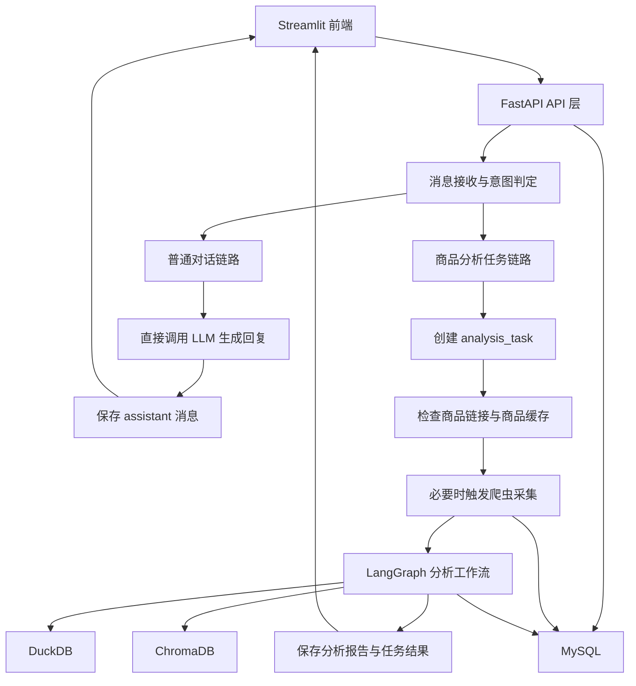
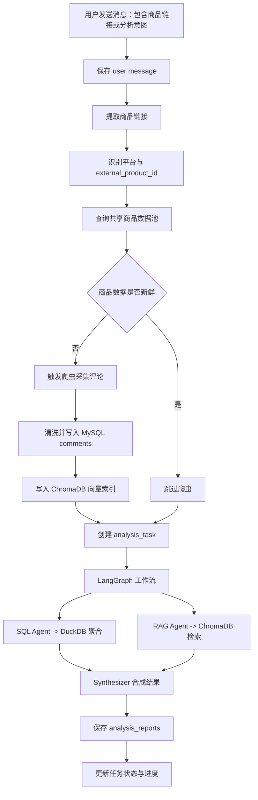
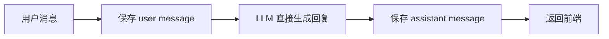

# 系统整体架构图

## 1. 技术选型
- 前端：Streamlit
  用于登录页、历史对话侧栏、聊天主区域、分析进度展示、图表结果展示。
- 后端：FastAPI + LangGraph + DeepSeek + DrissionPage
  FastAPI 负责统一 API 入口，LangGraph 负责分析工作流编排，DeepSeek 负责问答与总结生成，DrissionPage 负责商品评论采集。
- 存储：MySQL + DuckDB + ChromaDB
  MySQL 负责持久化业务数据，DuckDB 负责分析时临时聚合，ChromaDB 负责评论语义检索。

---

## 2. 系统分层架构

---

## 3. 统一消息入口与后端分流

### 3.1 统一入口原则
- 前端只有一个发送消息动作。
- 用户无论输入普通问题，还是输入带商品链接的分析问题，统一发送到后端消息接口。
- 后端收到消息后，先保存用户消息，再决定走哪条执行链路。

### 3.2 后端判定策略
- 第一层：规则判定
  - 是否包含商品 URL
  - 是否属于受支持平台，例如京东
  - 是否出现明显分析意图，例如“值不值得买”“为什么差评多”“帮我分析”
- 第二层：模型兜底
  - 当规则无法明确判断时，调用 Router Agent 或轻量 LLM 做意图分类。

### 3.3 两类执行结果
- 直接回复
  - 适用于普通聊天、追问、总结、解释类问题
  - 同步生成 assistant 回复并写回消息表
- 任务化分析
  - 适用于商品分析类问题
  - 创建分析任务，异步执行爬虫、聚合分析、语义检索和报告生成
  - 前端根据 `task_id` 查询进度和结果

这意味着：
- 前端入口统一
- 后端执行模型分流
- `message` 是输入载体
- `analysis_task` 是部分消息派生出的后台工作单

---

## 4. 商品分析任务链路

### 4.1 链路概览

### 4.2 关键处理步骤
1. 从消息中提取商品 URL，并解析平台商品 ID。
2. 在 MySQL 中按 `source + external_product_id` 查询商品。
3. 判断商品评论数据是否过期，例如最近一次抓取是否超过 3 天。
4. 数据过期时触发爬虫，采集评论并更新评论库与向量库。
5. 创建分析任务记录，供前端轮询进度。
6. 执行 LangGraph 工作流：
   - SQL Agent：读取评论并在 DuckDB 中做统计聚合
   - RAG Agent：在 ChromaDB 中检索高相关评论
   - Synthesizer：生成结论、证据摘要和图表配置
7. 将结果写入报告表，并将任务状态更新为完成或失败。

---

## 5. 普通对话链路

普通对话不创建分析任务，流程更轻：

适用场景：
- 日常问答
- 针对上一轮结果继续追问
- 要求总结已有回答
- 无商品链接、无分析任务需求的普通聊天

---

## 6. 数据存储职责

### 6.1 MySQL
MySQL 是系统唯一持久化业务数据源，负责保存：
- 用户账户
- 对话与消息
- 商品主数据
- 评论原始数据
- 分析任务状态
- 分析报告结果

### 6.2 DuckDB
DuckDB 只在分析任务执行期间使用：
- 从 MySQL 载入指定商品评论
- 做评分分布、维度聚合、差评率计算
- 任务完成后释放临时数据

### 6.3 ChromaDB
ChromaDB 用于评论语义检索：
- 为评论建立向量索引
- 按商品过滤后做相似评论召回
- 为总结生成提供证据片段

---

## 7. 数据边界与租户模型

### 7.1 共享商品数据
以下数据按商品复用，不按用户重复存储：
- `products`
- `comments`
- ChromaDB 评论向量

商品唯一标识建议使用：
- `source`
- `external_product_id`

### 7.2 用户私有数据
以下数据按 `user_id` 隔离：
- `conversations`
- `messages`
- `analysis_tasks`
- `analysis_reports`

这样可以避免：
- 同一商品被不同用户重复爬取
- 评论和向量数据冗余存储
- 用户之间对话和分析记录串扰

---

## 8. 关键设计原则

1. 前端统一消息入口，降低交互复杂度。
2. 后端统一接收后再分流，避免前端承担业务判定职责。
3. 普通回复与分析任务是两种执行模型，必须分别建模。
4. 商品数据共享，用户会话私有，兼顾复用和隔离。
5. 分析进度必须持久化，不能只依赖内存状态。
6. 爬虫、聚合分析、语义检索、总结生成解耦，便于后续替换实现。
