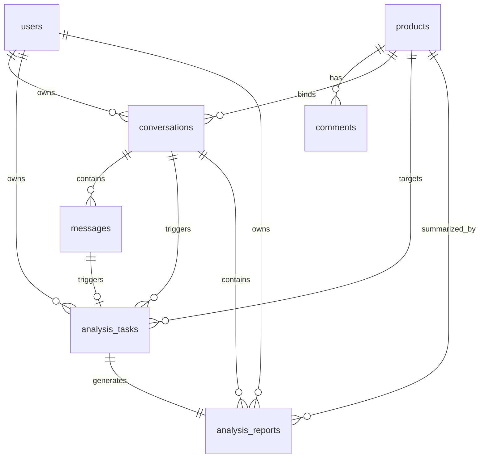

# 数据库设计

## 1. 设计目标

本设计用于支撑以下统一口径：
- 商品数据按商品复用，不按用户重复存储。
- 用户消息统一进入对话系统，只有部分消息会派生出分析任务。
- 分析进度需要持久化，不能只存在内存里。
- MySQL 保存业务真相，DuckDB 和 ChromaDB 只承担分析辅助角色。

---

## 2. MySQL 表结构设计

### 2.1 `users`（用户表）

| 字段名 | 类型 | 约束 | 说明 |
|--------|------|------|------|
| `id` | INT | PK, AUTO_INCREMENT | 用户内部 ID |
| `username` | VARCHAR(50) | UNIQUE, NOT NULL | 用户名 |
| `email` | VARCHAR(100) | UNIQUE, NOT NULL | 邮箱 |
| `hashed_password` | VARCHAR(255) | NOT NULL | 加密密码 |
| `is_active` | BOOLEAN | DEFAULT TRUE | 账户状态 |
| `created_at` | DATETIME | NOT NULL | 创建时间 |
| `updated_at` | DATETIME | NOT NULL | 更新时间 |

**索引建议**
- `uk_users_username`
- `uk_users_email`

---

### 2.2 `products`（商品主表，共享商品数据）

| 字段名 | 类型 | 约束 | 说明 |
|--------|------|------|------|
| `id` | BIGINT | PK, AUTO_INCREMENT | 商品内部主键 |
| `source` | VARCHAR(20) | NOT NULL | 商品来源平台，如 `jd` |
| `external_product_id` | VARCHAR(64) | NOT NULL | 平台商品 ID，如京东商品 ID |
| `product_url` | VARCHAR(500) | NOT NULL | 标准化后的商品链接 |
| `product_name` | VARCHAR(255) | NULL | 商品名称 |
| `crawl_status` | ENUM | NOT NULL | 爬取状态：`pending/crawling/completed/failed` |
| `comment_count` | INT | DEFAULT 0 | 当前已保存评论数 |
| `last_crawled_at` | DATETIME | NULL | 最近一次成功爬取时间 |
| `last_crawl_error` | TEXT | NULL | 最近一次爬取失败信息 |
| `created_at` | DATETIME | NOT NULL | 创建时间 |
| `updated_at` | DATETIME | NOT NULL | 更新时间 |

**设计说明**
- `id` 是数据库内部主键，只用于系统内部关联。
- `external_product_id` 是平台商品 ID，用于和 URL 解析结果对应。
- 商品唯一性建议由 `source + external_product_id` 保证，而不是只靠 URL。

**索引建议**
- `uk_products_source_external_product_id (source, external_product_id)`
- `idx_products_crawl_status`
- `idx_products_last_crawled_at`

---

### 2.3 `comments`（评论表，共享评论数据）

| 字段名 | 类型 | 约束 | 说明 |
|--------|------|------|------|
| `id` | BIGINT | PK, AUTO_INCREMENT | 评论内部 ID |
| `product_id` | BIGINT | FK → products.id, NOT NULL | 所属商品 |
| `source_comment_id` | VARCHAR(100) | NULL | 平台评论原始 ID |
| `content` | TEXT | NOT NULL | 评论文本 |
| `score` | TINYINT | NOT NULL | 综合评分，建议范围 1-5 |
| `dimension` | VARCHAR(20) | NULL | 评论维度，如物流/质量/价格/服务 |
| `dimension_score` | TINYINT | NULL | 维度评分 |
| `comment_time` | DATETIME | NULL | 评论发布时间 |
| `is_vectorized` | BOOLEAN | DEFAULT FALSE | 是否已写入向量库 |
| `created_at` | DATETIME | NOT NULL | 入库时间 |
| `updated_at` | DATETIME | NOT NULL | 更新时间 |

**索引建议**
- `idx_comments_product_id`
- `idx_comments_dimension`
- `idx_comments_score`
- `uk_comments_product_source_comment_id (product_id, source_comment_id)`

---

### 2.4 `conversations`（对话表，用户私有数据）

| 字段名 | 类型 | 约束 | 说明 |
|--------|------|------|------|
| `id` | INT | PK, AUTO_INCREMENT | 对话 ID |
| `user_id` | INT | FK → users.id, NOT NULL | 所属用户 |
| `title` | VARCHAR(100) | NULL | 对话标题 |
| `bound_product_id` | BIGINT | FK → products.id, NULL | 当前对话最近一次绑定的商品 |
| `created_at` | DATETIME | NOT NULL | 创建时间 |
| `updated_at` | DATETIME | NOT NULL | 更新时间 |

**设计说明**
- 普通对话可以没有商品绑定。
- 当某轮消息触发商品分析时，可以把该商品记录到 `bound_product_id`，方便历史列表展示。

**索引建议**
- `idx_conversations_user_id`
- `idx_conversations_bound_product_id`

---

### 2.5 `messages`（消息表，用户私有数据）

| 字段名 | 类型 | 约束 | 说明 |
|--------|------|------|------|
| `id` | BIGINT | PK, AUTO_INCREMENT | 消息 ID |
| `conversation_id` | INT | FK → conversations.id, NOT NULL | 所属对话 |
| `role` | ENUM | NOT NULL | `user/assistant/system` |
| `content` | TEXT | NOT NULL | 消息正文 |
| `message_type` | ENUM | NOT NULL | `chat/analysis_request/analysis_result/system_notice` |
| `created_at` | DATETIME | NOT NULL | 创建时间 |

**设计说明**
- 前端只管发送消息，后端可以根据意图把消息标记成不同类型。
- 商品分析请求本身仍然是一条消息，但它会进一步派生分析任务。

**索引建议**
- `idx_messages_conversation_id`
- `idx_messages_role`
- `idx_messages_message_type`

---

### 2.6 `analysis_tasks`（分析任务表，用户私有数据）

| 字段名 | 类型 | 约束 | 说明 |
|--------|------|------|------|
| `id` | BIGINT | PK, AUTO_INCREMENT | 任务内部 ID |
| `task_id` | VARCHAR(64) | UNIQUE, NOT NULL | 对外返回的任务标识 |
| `user_id` | INT | FK → users.id, NOT NULL | 所属用户 |
| `conversation_id` | INT | FK → conversations.id, NOT NULL | 来源对话 |
| `product_id` | BIGINT | FK → products.id, NOT NULL | 分析目标商品 |
| `trigger_message_id` | BIGINT | FK → messages.id, NOT NULL | 触发任务的用户消息 |
| `question` | VARCHAR(500) | NOT NULL | 用户问题摘要 |
| `status` | ENUM | NOT NULL | `pending/processing/completed/failed` |
| `current_step` | VARCHAR(50) | NULL | 当前步骤，如 `crawling/sql_agent/rag_agent/synthesizer` |
| `progress` | INT | DEFAULT 0 | 0-100 的任务进度 |
| `error_message` | TEXT | NULL | 失败原因 |
| `started_at` | DATETIME | NULL | 开始执行时间 |
| `finished_at` | DATETIME | NULL | 结束时间 |
| `created_at` | DATETIME | NOT NULL | 创建时间 |
| `updated_at` | DATETIME | NOT NULL | 更新时间 |

**设计说明**
- `task_id` 是前端轮询进度和获取结果时使用的业务标识。
- `trigger_message_id` 用来建立“哪条消息触发了这个任务”的因果关系。
- 任务进度必须以表字段持久化，不能只写在内存变量中。

**索引建议**
- `uk_analysis_tasks_task_id`
- `idx_analysis_tasks_user_id`
- `idx_analysis_tasks_conversation_id`
- `idx_analysis_tasks_product_id`
- `idx_analysis_tasks_status`

---

### 2.7 `analysis_reports`（分析报告表，用户私有数据）

| 字段名 | 类型 | 约束 | 说明 |
|--------|------|------|------|
| `id` | BIGINT | PK, AUTO_INCREMENT | 报告 ID |
| `analysis_task_id` | BIGINT | FK → analysis_tasks.id, UNIQUE, NOT NULL | 来源任务 |
| `user_id` | INT | FK → users.id, NOT NULL | 所属用户 |
| `conversation_id` | INT | FK → conversations.id, NOT NULL | 所属对话 |
| `product_id` | BIGINT | FK → products.id, NOT NULL | 分析商品 |
| `summary` | TEXT | NOT NULL | 文本总结 |
| `statistics_json` | JSON | NULL | 聚合统计结果 |
| `charts_config` | JSON | NULL | 图表配置 |
| `evidence_json` | JSON | NULL | 证据评论摘要 |
| `created_at` | DATETIME | NOT NULL | 创建时间 |

**设计说明**
- 一个分析任务默认产出一份报告，因此建议 `analysis_task_id` 唯一。
- 若后续需要支持“同一任务多版报告”，可以去掉唯一约束并增加 `version` 字段。

**索引建议**
- `uk_analysis_reports_analysis_task_id`
- `idx_analysis_reports_user_id`
- `idx_analysis_reports_product_id`

---

## 3. 实体关系图



关系说明：
- `products/comments` 是共享商品数据。
- `conversations/messages/analysis_tasks/analysis_reports` 是用户私有数据。
- 一条用户消息可以触发一个分析任务。
- 一个分析任务默认对应一份分析报告。

---

## 4. ChromaDB 集合设计

### 集合名称：`product_comments`

| 字段 | 类型 | 说明 |
|------|------|------|
| `id` | str | 对应 MySQL `comments.id` |
| `embedding` | List[float] | 评论向量 |
| `document` | str | 评论原文 |
| `metadata.product_id` | int | MySQL 商品内部 ID |
| `metadata.source` | str | 平台来源 |
| `metadata.external_product_id` | str | 平台商品 ID |
| `metadata.score` | int | 评论评分 |
| `metadata.dimension` | str | 评论维度 |
| `metadata.comment_time` | str | 评论时间 |

**查询示例**
```python
collection.query(
    query_texts=["物流太慢"],
    n_results=5,
    where={"product_id": 12345}
)
```

说明：
- ChromaDB 里的 `product_id` 指 MySQL `products.id`，不是平台商品 ID。
- 如需按平台商品 ID 回查，应先通过 MySQL 找到 `products.id`。

---

## 5. DuckDB 临时分析设计

DuckDB 不保存业务真相，只在任务执行期承担临时聚合计算。

### 临时表：`temp_comments`

```sql
CREATE TEMP TABLE temp_comments AS
SELECT
    id,
    product_id,
    content,
    score,
    dimension,
    dimension_score,
    comment_time
FROM comments
WHERE product_id = ?;
```

### 常用聚合示例

```sql
SELECT
    dimension,
    COUNT(*) AS total,
    ROUND(AVG(score), 2) AS avg_score,
    ROUND(
        SUM(CASE WHEN score <= 2 THEN 1 ELSE 0 END) * 100.0 / COUNT(*),
        2
    ) AS bad_rate_pct
FROM temp_comments
GROUP BY dimension
ORDER BY avg_score ASC;

SELECT
    score,
    COUNT(*) AS cnt
FROM temp_comments
GROUP BY score
ORDER BY score;
```

---

## 6. 关键约束总结

1. `products.id` 是内部主键，`external_product_id` 是平台商品 ID，二者必须明确区分。
2. `products` 表不再直接存 `user_id`，避免同商品被不同用户重复入库。
3. 分析进度必须依赖 `analysis_tasks` 持久化。
4. `analysis_reports` 是结果实体，`analysis_tasks` 是过程实体，二者不能混用。
5. 向量库和 DuckDB 都是分析辅助层，不承担业务主数据职责。
