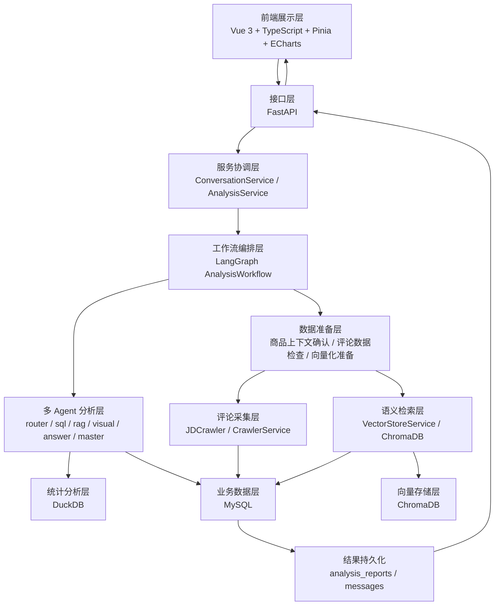
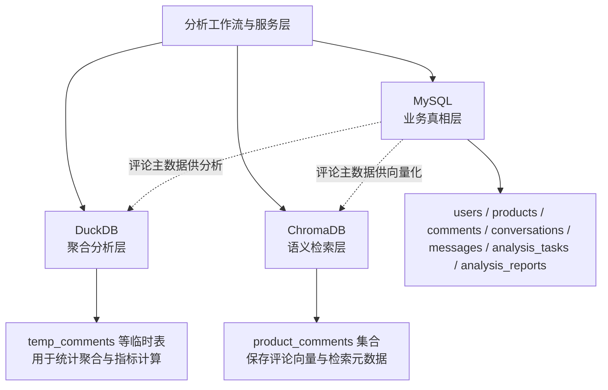
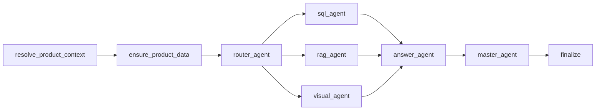
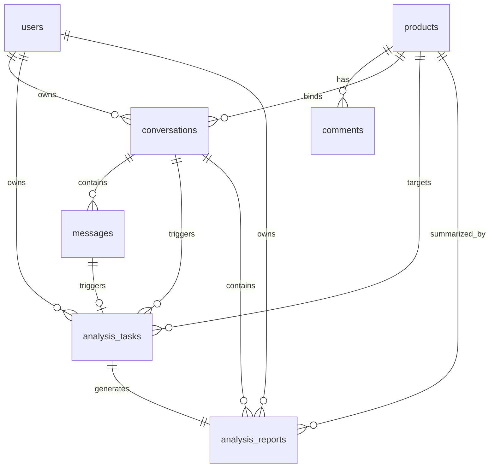
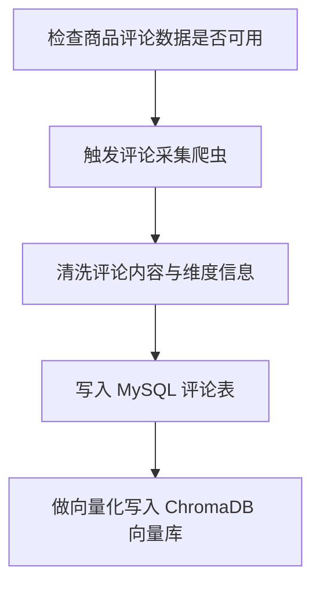
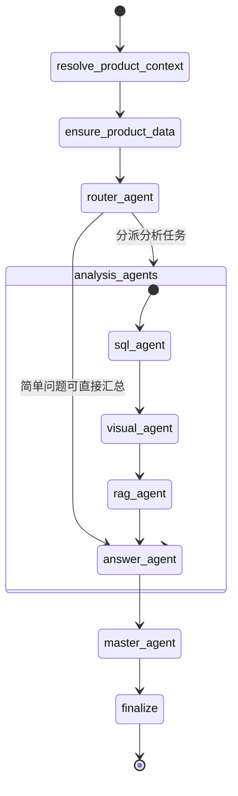
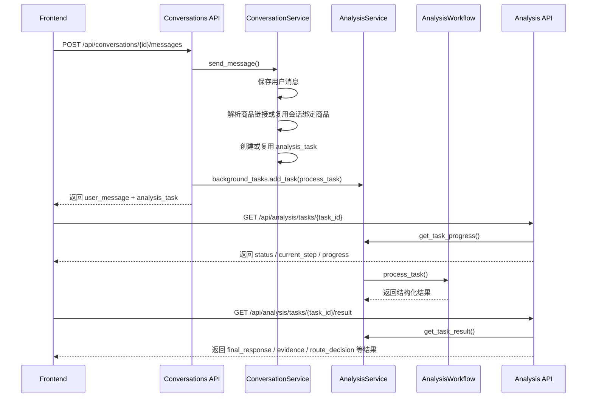

# 非实验图表初稿

## 说明

本文件仅整理当前系统中“不依赖实验结果、不依赖运行截图”的图表初稿，可直接作为论文插图和表格的基础素材。

整理依据仅限以下现有材料：
- `docs/1.需求分析.md`
- `docs/2.系统整体架构图.md`
- `docs/4.数据库设计.md`
- `docs/5.API接口定义.md`
- `backend/app/api/conversations.py`
- `backend/app/api/analysis.py`
- `backend/app/agents/workflow.py`
- `backend/app/services/analysis_service.py`
- `backend/app/crawlers/jd_crawler.py`
- `frontend-vue/src/router/index.ts`
- `frontend-vue/src/stores/chat.ts`

使用约束：
- 不补写当前系统不存在的模块。
- 不把未来可能补充的截图、测试表、模型对比表混入本文件。
- 图表编号与 [论文插图表格清单.md](</D:/学业/大四/毕业设计/MA-ESAS-1/论文报告/论文插图表格清单.md:1>) 保持一致。

---

## F-01 系统总体架构图

- 建议章节位置：`3.1 系统整体架构设计`
- 主要依据：`docs/2.系统整体架构图.md`

图示说明建议：
- 本图用于概括当前系统从前端发起请求，到后端任务调度、多 Agent 工作流执行、数据采集与存储，再到结果返回前端的完整链路。
- 图中不再采用旧版“双链路分流”的描述，而是统一体现“统一消息入口 + 任务化分析 + 多 Agent 工作流”的真实实现。

---

## F-02 三层存储架构图

- 建议章节位置：`3.2 三层存储架构设计`
- 主要依据：`docs/2.系统整体架构图.md`、`docs/4.数据库设计.md`

图示说明建议：
- 本图重点说明三类存储不是并列主库。
- MySQL 负责业务主数据与任务结果持久化，DuckDB 仅承担临时聚合分析，ChromaDB 仅承担评论向量索引与语义检索。

---

## F-03 多 Agent 协作流程图

- 建议章节位置：`3.3 多智能体协作架构设计`
- 主要依据：`backend/app/agents/workflow.py`、`docs/2.系统整体架构图.md`

图示说明建议：
- 本图仅保留主协作结构，用于说明前置准备、路由分流、分析执行、答案汇总和结果审查之间的关系。
- 实际执行时，`router_agent` 会根据问题内容选择一个或多个分析节点，图中不再展开 `need_sql`、`need_rag`、`need_visual` 等条件分支。
- `master_agent` 在必要时还会要求局部节点重试，这一回路建议放到正文中用文字说明，不继续堆叠在图中。
- 论文正文可结合说明：`resolve_product_context` 与 `ensure_product_data` 是当前真实实现中的两个关键前置节点。

---

## F-04 E-R 图

- 建议章节位置：`3.4 数据库设计与 E-R 图`
- 主要依据：`docs/4.数据库设计.md`

图示说明建议：
- 本图可直接用于解释“商品数据共享、用户链路私有”的数据库设计思想。
- 正文中建议补一句：`products/comments` 为共享商品数据，`conversations/messages/analysis_tasks/analysis_reports` 为用户私有链路数据。

---

## F-05 评论采集与清洗流程图

- 建议章节位置：`5.1 商品评论采集模块实现`
- 主要依据：`backend/app/crawlers/jd_crawler.py`、`docs/2.系统整体架构图.md`

图示说明建议：
- 本图改为论文简化版，只保留“检查数据、触发采集、获取评论、清洗、入库、向量化”六个核心阶段。
- 诸如等待节点、滚动评论区域、解析 `commentInfo` 等实现细节建议写入正文，不再全部堆到图里。

---

## F-06 LangGraph 状态流转图

- 建议章节位置：`5.2 多智能体工作流实现`
- 主要依据：`backend/app/agents/workflow.py`

图示说明建议：
- 本图改为简化版，只保留状态推进主线和“分析节点组”的概念，不在图中展开所有条件分支与重试回路。
- `router_agent` 的分流规则以及 `master_agent` 的重试逻辑建议放在正文中说明，而不是继续堆叠到同一张图里。
- 若正文中只保留一张工作流图，建议在第三章保留 `F-03`，在第五章保留当前简化版 `F-06`，前者强调结构，后者强调执行推进。

---

## F-07 API 交互时序图

- 建议章节位置：`5.4 后端 API 设计与实现`
- 主要依据：`docs/5.API接口定义.md`、`backend/app/api/conversations.py`、`backend/app/api/analysis.py`、`frontend-vue/src/stores/chat.ts`

图示说明建议：
- 本图用于支撑“发送消息 -> 轮询进度 -> 拉取结果”的三段式接口协作模式。
- 正文中应明确：发送消息接口当前不直接返回最终分析结论，而是立即返回 `task_id` 供前端轮询。

---

## T-03 核心 API 汇总表

- 建议章节位置：`5.4 后端 API 设计与实现`
- 主要依据：`docs/5.API接口定义.md`、`backend/app/api/conversations.py`、`backend/app/api/analysis.py`

| 接口 | 方法 | 主要作用 | 是否鉴权 | 关键返回内容 |
|---|---|---|---|---|
| `/api/auth/register` | `POST` | 用户注册 | 否 | 用户基础信息 |
| `/api/auth/login` | `POST` | 用户登录 | 否 | 用户信息、`access_token`、过期时间 |
| `/api/auth/me` | `GET` | 获取当前登录用户 | 是 | 当前用户信息 |
| `/api/conversations` | `POST` | 创建新会话 | 是 | `conversation` 基本信息 |
| `/api/conversations` | `GET` | 获取会话列表 | 是 | 分页会话列表、最近任务摘要 |
| `/api/conversations/{conversation_id}` | `GET` | 获取会话详情 | 是 | 会话、消息时间线、任务摘要 |
| `/api/conversations/{conversation_id}/messages` | `POST` | 发送消息并创建或复用分析任务 | 是 | `user_message`、`analysis_task` |
| `/api/conversations/{conversation_id}/messages` | `GET` | 获取会话消息列表 | 是 | `MessageResponse[]` |
| `/api/conversations/{conversation_id}` | `PATCH` | 更新会话标题 | 是 | 更新后的会话信息 |
| `/api/conversations/{conversation_id}` | `DELETE` | 删除会话 | 是 | 被删除的会话 ID |
| `/api/conversations/{conversation_id}/tasks` | `GET` | 获取会话关联任务列表 | 是 | `ConversationTaskResponse[]` |
| `/api/analysis/tasks/{task_id}` | `GET` | 查询任务进度 | 是 | `status`、`current_step`、`progress`、`steps` |
| `/api/analysis/tasks/{task_id}/result` | `GET` | 获取结构化分析结果 | 是 | `final_response`、`product_context`、`data_context`、`evidence` 等 |
| `/api/analysis/tasks/{task_id}/retry` | `POST` | 重试失败任务 | 是 | 重置后的任务进度结构 |

表格说明建议：
- 若论文版面有限，可只保留认证、消息发送、任务进度、任务结果、任务重试五类核心接口。
- 表中不应写入旧版协议里的 `reply_message` 或 `handling_mode`，因为当前实现已统一进入任务链路。

---

## T-06 核心数据表作用汇总表

- 建议章节位置： `3.4 数据库设计与 E-R 图`
- 主要依据：`docs/4.数据库设计.md`

| 数据表 | 数据属性 | 核心作用 | 关键关系 |
|---|---|---|---|
| `users` | 用户主数据 | 保存系统用户账户信息 | 与 `conversations`、`analysis_tasks`、`analysis_reports` 关联 |
| `products` | 共享商品数据 | 保存商品基础信息、平台来源、爬取状态与最近爬取信息 | 与 `comments`、`conversations`、`analysis_tasks`、`analysis_reports` 关联 |
| `comments` | 共享评论数据 | 保存商品评论正文、评分、维度、发布时间及向量化状态 | 通过 `product_id` 归属到 `products` |
| `conversations` | 用户私有链路数据 | 保存用户会话及当前绑定商品 | 与 `messages`、`analysis_tasks`、`analysis_reports` 关联 |
| `messages` | 用户私有链路数据 | 保存用户消息、分析请求、分析结果摘要和系统通知 | 通过 `conversation_id` 归属会话，并可触发任务 |
| `analysis_tasks` | 用户私有过程数据 | 持久化分析任务状态、进度、当前步骤和错误信息 | 与 `messages`、`analysis_reports` 建立过程到结果的因果关系 |
| `analysis_reports` | 用户私有结果数据 | 保存最终文本总结、统计结果、图表配置和证据摘要 | 与 `analysis_tasks` 一对一关联 |

表格说明建议：
- 本表适合用来解释为什么系统同时需要“任务表”和“报告表”。
- 正文可进一步概括：`analysis_tasks` 表示分析过程，`analysis_reports` 表示分析产物，二者不能混用。

---

## T-07 存储层分工对比表

- 建议章节位置：`3.2 三层存储架构设计`
- 主要依据：`docs/4.数据库设计.md`、`docs/2.系统整体架构图.md`

| 存储层 | 存储内容 | 是否业务主数据 | 主要用途 | 与其他层关系 |
|---|---|---|---|---|
| MySQL | 用户、商品、评论、会话、消息、任务、报告 | 是 | 承担业务真相持久化、任务状态管理、结果落库 | 为 DuckDB 和 ChromaDB 提供评论主数据来源 |
| DuckDB | `temp_comments` 等临时分析表 | 否 | 在任务执行期做统计聚合和指标计算 | 从 MySQL 读取评论数据，不单独作为主库 |
| ChromaDB | 评论向量、评论原文、商品与评分元数据 | 否 | 为 `rag_agent` 提供语义检索和证据召回能力 | 由 MySQL 评论数据向量化后写入 |

表格说明建议：
- 本表应配合 `F-02` 使用，一图一表分别承担“结构关系说明”和“职责边界归纳”。
- 正文里建议强调：DuckDB 与 ChromaDB 都是分析辅助层，不承担业务真相存储职责。

---

## T-08 核心用例说明表

- 建议章节位置：`4.5 系统核心业务流程分析`
- 主要依据：`docs/1.需求分析.md`、`docs/5.API接口定义.md`、`frontend-vue/src/stores/chat.ts`

| 用例名称 | 参与者 | 输入 | 系统处理 | 输出 / 反馈 |
|---|---|---|---|---|
| 用户注册与登录 | 普通用户 | 用户名、邮箱、密码 | 调用认证接口完成注册或登录，返回访问令牌 | 进入已登录状态，可访问聊天工作台 |
| 创建新会话 | 已登录用户 | 创建会话操作 | 调用会话创建接口生成新会话记录 | 左侧历史会话列表出现新会话 |
| 发起商品评论分析 | 已登录用户 | 自然语言问题和商品链接，或会话已绑定商品 | 保存用户消息，解析商品上下文，创建或复用分析任务，并异步调度工作流 | 立即返回任务 ID，前端开始轮询 |
| 查看分析进度 | 已登录用户 | 任务 ID | 前端轮询任务进度接口，后端返回当前步骤、进度和步骤状态 | 用户看到任务从 `pending/processing` 向完成推进 |
| 查看分析结果 | 已登录用户 | 已完成任务 ID | 前端调用结果接口，后端返回文本结论、图表、证据与过程信息 | 聊天工作台展示结构化分析结果 |
| 重试失败任务 | 已登录用户 | 失败任务 ID | 调用重试接口重置任务状态并重新调度分析流程 | 任务重新进入轮询流程 |

表格说明建议：
- 本表用于替代复杂 UML 用例图，更适合文字型毕业论文。
- 其中“普通 chat 聊天”不应单独写成当前已实现的一条同步回复主链路，应严格以现有统一消息入口实现为准。

---

## 使用建议

1. 第三章优先放 `F-01`、`F-02`、`F-03`、`F-04`。
2. 第五章优先放 `F-05`、`F-06`、`F-07`、`T-03`。
3. `T-06`、`T-07`、`T-08` 适合用于压缩说明文字密度，可在正文成稿时再微调措辞。
4. 若学校模板不支持 mermaid，可按本文件的结构关系重绘成 Visio、ProcessOn 或 draw.io 版本，但节点含义不应改动。

---

## 图题、表题与插入位置建议

本节用于把上面的图表初稿进一步收敛成可直接落入论文正文的材料。题名、图下注释和插入位置均严格对应当前系统文档与代码，不额外扩展新内容。

| 编号 | 推荐题名 | 建议插入位置 | 图注 / 表注建议 | 正文引出建议 |
|---|---|---|---|---|
| F-01 | 图 3-1 系统总体架构图 | 第三章 `3.1 系统整体架构设计` 末尾 | 本图展示了当前系统从前端工作台、FastAPI 接口层、服务协调层、LangGraph 工作流层，到评论采集、统计分析、语义检索和结果持久化的整体关系。 | 在介绍完前后端分离、任务化分析和多 Agent 协作后插入，用于总览全局结构。 |
| F-02 | 图 3-2 三层存储架构图 | 第三章 `3.2 三层存储架构设计` 中部 | 本图展示了 MySQL、DuckDB 与 ChromaDB 在当前系统中的职责边界，其中 MySQL 承担业务真相持久化，DuckDB 负责临时聚合分析，ChromaDB 负责评论向量检索。 | 在说明“三层存储并非并列主库”后插入，用于支撑后续数据库与检索设计。 |
| F-03 | 图 3-3 多智能体协作流程图 | 第三章 `3.3 多智能体协作架构设计` 中部 | 本图展示了当前工作流中前置准备、路由分流、分析执行、答案汇总、结果审查和最终收束之间的主协作关系。复杂分支与重试机制在正文中补充说明。 | 在说明工作流中的节点分工后插入，突出当前系统并非固定串行执行所有 Agent。 |
| F-04 | 图 3-4 系统数据库实体关系图 | 第三章 `3.4 数据库设计与 E-R 图` 中部 | 本图展示了用户、商品、评论、会话、消息、分析任务和分析报告之间的实体关系，体现了共享商品数据与用户私有分析链路的区分。 | 在介绍主要数据表后插入，用于支撑“过程数据”和“结果数据”分离设计。 |
| F-05 | 图 5-1 评论采集与清洗流程图 | 第五章 `5.1 商品评论采集模块实现` 中后部 | 本图展示了系统在数据准备阶段按需触发京东评论采集，并完成接口监听、评论解析、数据清洗、入库与向量化的处理流程。 | 在说明 DrissionPage 爬虫接入主程序后插入，强调当前实现是真实采集链路。 |
| F-06 | 图 5-2 LangGraph 状态流转图 | 第五章 `5.2 多智能体工作流实现` 中部 | 本图展示了当前 LangGraph 工作流中的主要状态节点、条件分支和 `master_agent` 的重试回路。 | 在说明 `router_agent` 的分支决策和 `master_agent` 的审查逻辑后插入。 |
| F-07 | 图 5-3 API 交互时序图 | 第五章 `5.4 后端 API 设计与实现` 中部 | 本图展示了前端发送消息、后端创建任务、前端轮询进度并拉取结果的三段式接口交互流程。 | 在说明消息接口不直接返回最终结论后插入，用于支撑任务化协议设计。 |
| T-03 | 表 5-1 核心 API 汇总表 | 第五章 `5.4 后端 API 设计与实现` 末尾 | 本表汇总了认证、会话、消息发送、任务进度、任务结果和任务重试等核心接口的用途与返回内容。 | 在时序图之后插入，用于把接口层设计压缩成可检索的结构化表格。 |
| T-06 | 表 2-1 核心数据表作用汇总表 | 第二章 `2.4 核心数据结构设计` 末尾 | 本表归纳了当前系统各核心数据表的职责、属性类别及关键关系，用于说明数据库设计的业务语义。 | 在介绍主要表结构后插入，用于收束第二章的数据模型说明。 |
| T-07 | 表 3-1 存储层分工对比表 | 第三章 `3.2 三层存储架构设计` 末尾 | 本表对比了 MySQL、DuckDB 和 ChromaDB 的存储内容、用途及是否承担业务主数据职责。 | 建议紧跟 `F-02` 之后插入，形成“一图一表”的配套说明。 |
| T-08 | 表 4-1 核心用例说明表 | 第四章 `4.5 系统核心业务流程分析` 末尾 | 本表从用户视角归纳了注册登录、创建会话、发起分析、查看进度、查看结果和重试失败任务等核心业务用例。 | 在完成业务流程文字分析后插入，用于替代复杂 UML 用例图。 |

### 图注与表注写法建议

1. 图注和表注应写成“说明图表表达了什么”，不要写成“该图很好地展示了什么”这类评价句。
2. 对于 `F-03`、`F-06` 这类工作流图，正文中应同步解释条件分支含义，否则图会显得过于抽象。
3. 对于 `T-03`、`T-06`、`T-07`、`T-08` 这类表格，建议在表前先用 1 句话交代“为何需要此表”，再在表后用 1 句话总结最关键结论。

### 编号使用建议

1. 若论文最终目录保持当前顺序，可直接采用本节给出的“章序号-图表序号”写法。
2. 若后续你把“系统需求分析”和“系统概要设计”对调，只需要同步调整第二章、第三章、第四章相关图表编号，不需要重做图表内容。
3. 在正式排版时，建议统一使用“图 x-x”“表 x-x”格式，不要在正文中同时混用 `F-01`、`T-03` 这类内部编号。
